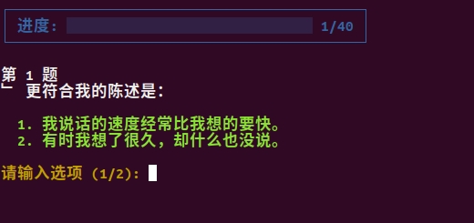

# MBTI-Test

[](https://opensource.org/licenses/MIT) [](https://www.python.org/) [](https://pypi.org/project/mbti-test/)

[English](README.md) | [中文](README_zh.md)

MBTI-Test 是一个用于进行 MBTI 人格测试的命令行应用程序，使用 Python 编写，具有良好的交互界面，支持中英文测试，提供多个版本的 MBTI 测试题，测试结果准确。

## 描述

这个程序允许用户直接在命令行中进行 MBTI 人格测试。它包含了 28 题（极速体验版）、40 题（通用测试版）和 93 题（标准完整版）三个版本的测试题。相对于市面上各种网页、App、小程序版的 MBTI 测试软件，它是一个简单实用并且完全免费的工具。

## 功能

- 多个测试版本：极速体验版（28 题）、通用测试版（40 题）和标准完整版（93 题）
- 简单易用的命令行界面
- 结果计算与展示
- 可将结果保存到 CSV 文件

## 安装

```bash
pip install mbti-test
```

## 使用

mbti-test 命令行使用示例：

```bash
mbti-test --help                     # 显示帮助信息
mbti-test --questions 40             # 运行 40 题通用测试版本（默认为中文）
mbti-test --questions 40 --lang en   # 运行 40 题通用测试版本（英文）
mbti-test --questions 40 --save      # 运行 40 题通用测试版本，并将结果保存到 CSV 文件
mbti-test --version                  # 显示版本信息
```

## 运行测试

执行下面命令开始测试（通用版）：

```bash
mbti-test --questions 40
```

MBTI 测试界面截图：



MBTI 测试结果输出：

```bash
✨ 测试完成！正在生成结果...

你的 MBTI 类型结果:
总体类型: INTJ

维度得分:
外向 (E) vs 内向 (I): 5 - 6
实感 (S) vs 直觉 (N): 3 - 6
理智 (T) vs 情感 (F): 6 - 3
判断 (J) vs 理解 (P): 6 - 5
```

